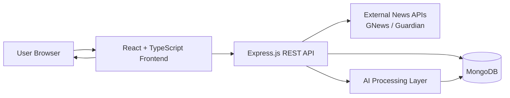
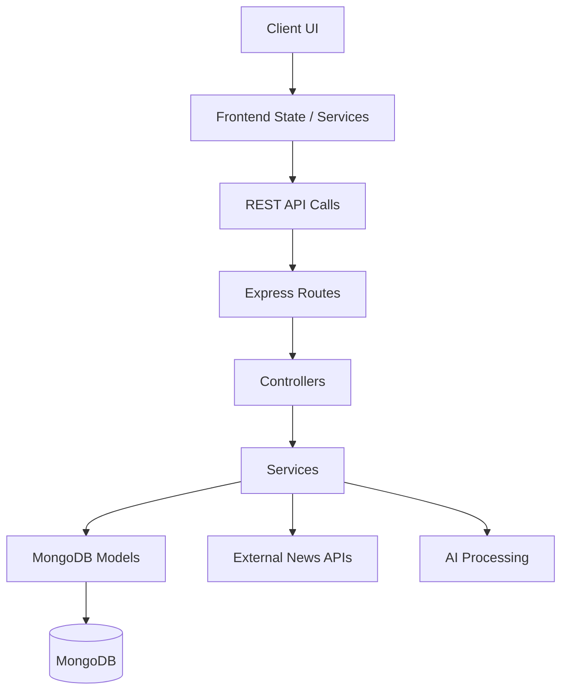
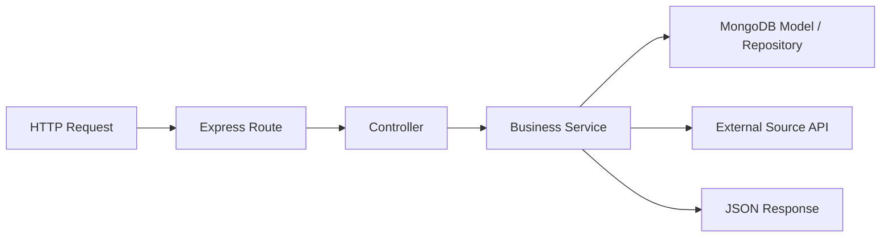
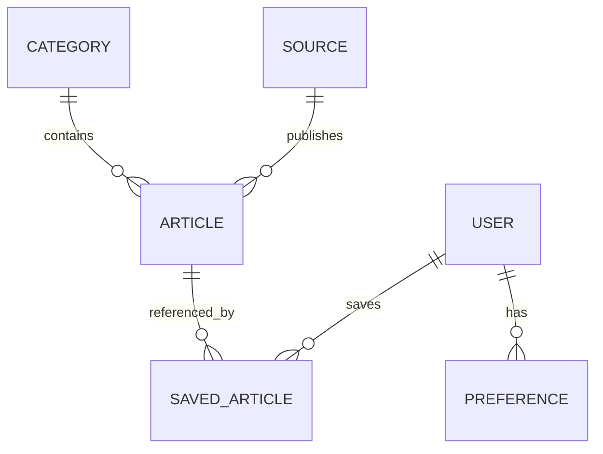
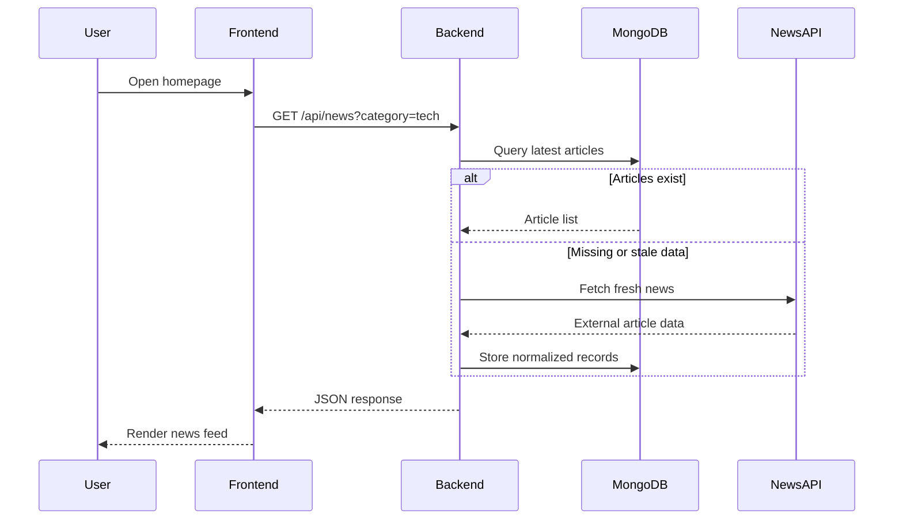
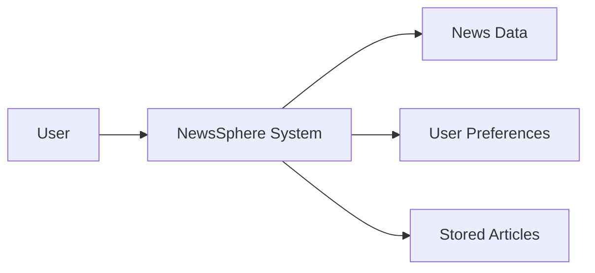
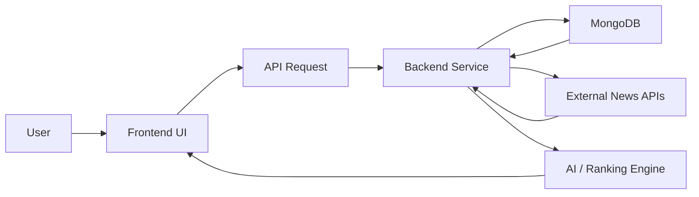

# NewsSphere AI System Architecture

## 1. High-Level Architecture

NewsSphere AI is a full-stack news aggregation platform that collects news from multiple sources, stores normalized article data, and presents personalized, AI-assisted content to users through a modern web interface.

The system is designed as a layered architecture with clear separation between the user interface, application logic, data access layer, and external data providers.

### Architectural Overview



### Core Layers

1. Presentation Layer
   - React frontend built with TypeScript
   - User-facing pages for news feed, categories, saved articles, and preferences
   - Deployed locally in development and accessible through a browser

2. Application Layer
   - Express.js backend provides REST endpoints
   - Business logic handles fetch, filtering, categorization, and recommendation logic
   - Middleware handles validation, error responses, and authentication/authorization later on

3. Data Layer
   - MongoDB stores users, source metadata, article records, saved items, and preferences
   - Data is normalized for search, filtering, and future recommendation features

4. Integration Layer
   - External news APIs are used to collect fresh content
   - AI/content processing layer can classify articles, detect relevance, or prioritize headlines

5. Intelligence Layer
   - AI logic may be used in future phases to score relevance, cluster topics, or personalize content

---

## 2. Component Architecture

NewsSphere is composed of modular components across frontend and backend that interact through a structured API contract.

### Frontend Components

- App Shell
  - Global layout, navigation, theme containers, and route rendering
- News Feed Components
  - Article cards, category filters, trending topics, headline lists
- Search and Filter Components
  - Search bar, source filters, date filters, tag filters
- User Components
  - Login/profile UI, saved articles, reading history, preferences
- Utility Components
  - Loading spinners, empty states, error banners, cards, modals

### Backend Components

- Server Entry Point
  - Starts Express application and configures middleware
- Routes
  - `/api/news`, `/api/sources`, `/api/users`, `/api/preferences`, `/api/health`
- Controllers
  - Handle request parsing and response formatting
- Services
  - Fetch articles from sources
  - Normalize article metadata
  - Filter or categorize content
  - Manage user preferences and saved items
- Models
  - MongoDB schemas for news items, users, sources, categories, and bookmarks
- Data Access Layer
  - Encapsulates database read/write operations

### System Component Relationship



---

## 3. Frontend Architecture

The frontend is a React + TypeScript single-page application designed for responsiveness, maintainability, and fast user interaction.

### Frontend Responsibilities

- Render the news feed and navigation
- Allow users to browse articles by category and source
- Support search and filtering
- Display article detail pages
- Provide saved articles and user preference management
- Handle loading, error, and empty states gracefully

### Frontend Structure

```text
frontend/
  src/
    App.tsx
    main.tsx
    components/
      Navbar/
      NewsFeed/
      ArticleCard/
      Filters/
      Sidebar/
    pages/
      HomePage/
      ArticlePage/
      SavedPage/
      ProfilePage/
    services/
      api.ts
      newsService.ts
    hooks/
      useNews.ts
      useAuth.ts
    context/
      AppContext.tsx
    styles/
      index.css
```

### Frontend Design Principles

- Component-driven UI architecture
- Type-safe development with TypeScript
- Reusable UI building blocks
- Decoupled API service layer for easier testing and maintenance
- Responsive layout for desktop and mobile screens

### Interaction Pattern

The frontend does not directly connect to databases or external APIs. Instead, it sends HTTP requests to the backend API, which acts as the system intermediary.

---

## 4. Backend Architecture

The backend is implemented with Node.js and Express in TypeScript, which gives the project a fast, scalable server-side foundation with strong types and maintainable structure.

### Backend Responsibilities

- Receive requests from the frontend
- Validate and sanitize input
- Connect to MongoDB
- Fetch and normalize stories from external news sources
- Apply filtering, sorting, and prioritization
- Return structured JSON responses to the client

### Typical Backend Flow



### Middleware and Logic Layers

- CORS middleware for cross-origin access
- JSON parsing middleware
- Request validation
- Error-handling middleware
- Logging and monitoring hooks
- Route-specific handlers for articles, users, and preferences

### Why This Works Well

- Simple API layer for a content-driven app
- Easy integration with MongoDB and external APIs
- Fast development with TypeScript and modern Node tooling
- Scales well for future user accounts and personalization features

---

## 5. Database Architecture

MongoDB is selected for the data layer because the application deals with semi-structured content such as article metadata, tags, source details, and user activity logs.

### Core Collections

1. Users
   - userId
   - name
   - email
   - preferences
   - savedArticles
   - createdAt

2. Articles
   - title
   - summary
   - source
   - author
   - publishedAt
   - url
   - category
   - tags
   - sentimentScore
   - imageUrl

3. Sources
   - sourceName
   - apiProvider
   - category
   - reliabilityScore
   - isActive

4. Bookmarks / Saved Articles
   - userId
   - articleId
   - savedAt

5. Preferences
   - userId
   - interests
   - categories
   - blockedSources
   - language

### Database Design Principles

- Flexible schema for dynamic article content
- Easy indexing for filtering by source, category, date, and user preference
- Storage efficiency for content-heavy feeds
- Supports future growth into recommendation and personalized ranking features

### Example Relationship Model



---

## 6. API Communication Flow

The frontend and backend communicate over a REST API using JSON payloads.

### Standard Request Flow

1. User opens the homepage or news feed.
2. React frontend sends a GET request to the backend API.
3. Backend validates parameters such as category, source, or search term.
4. Backend queries MongoDB or calls the external news API.
5. Results are normalized and returned as JSON.
6. Frontend renders the data into cards, feed items, and panels.

### Example API Sequence



---

## 7. Data Flow Diagrams (DFD)

### Level 0 DFD



### Level 1 DFD



### Data Flow Description

- Users interact with the UI and request news content.
- The frontend sends API requests to the backend.
- The backend fetches data from MongoDB if available and enriches it from external news feeds when needed.
- Processed articles are classified, filtered, and returned to the user.
- User actions such as save, like, or preference changes are persisted back into the database.

---

## 8. Technology Justification

### React + TypeScript

- Strong component model for UI development
- Type-safety reduces runtime errors
- Cleaner scaling for a complex dashboard and article interface
- Good developer experience and ecosystem support

### Node.js + Express

- Fast server-side runtime for handling JSON APIs
- Lightweight framework suitable for content and service endpoints
- Excellent support for REST-based architecture
- Easy integration with MongoDB and third-party APIs

### MongoDB

- Flexible document model fits article and user data well
- Fast query and indexing capabilities for feeds and preferences
- Easy handling of varied article metadata
- Good fit for future recommendation and personalization requirements

### GNews / Guardian API

- Reliable sources of fresh news data
- Support for category and region-based aggregation
- Strong content coverage for a news platform
- Allows the system to avoid relying on a single news feed

### Tailwind CSS

- Rapid UI development
- Consistent styling and component design
- Easy maintenance and responsive interface building

### Why This Stack Fits the Project

The chosen technology stack balances speed, flexibility, and maintainability. React gives a modern and responsive frontend experience, while Node.js and Express provide a quick-to-build API layer. MongoDB supports flexible, content-heavy data storage, and external news APIs provide rich, up-to-date information. Together, they form a reliable architecture for a scalable AI-powered news platform.

---

## 9. Summary

NewsSphere AI follows a modular, layered architecture with a React frontend, Express backend, MongoDB data layer, and external news integrations. The application is designed to support real-time content aggregation, normalized storage, and future AI-enhanced personalization. The architecture is intentionally simple, maintainable, and extensible, making it suitable for both prototype development and future production growth.
