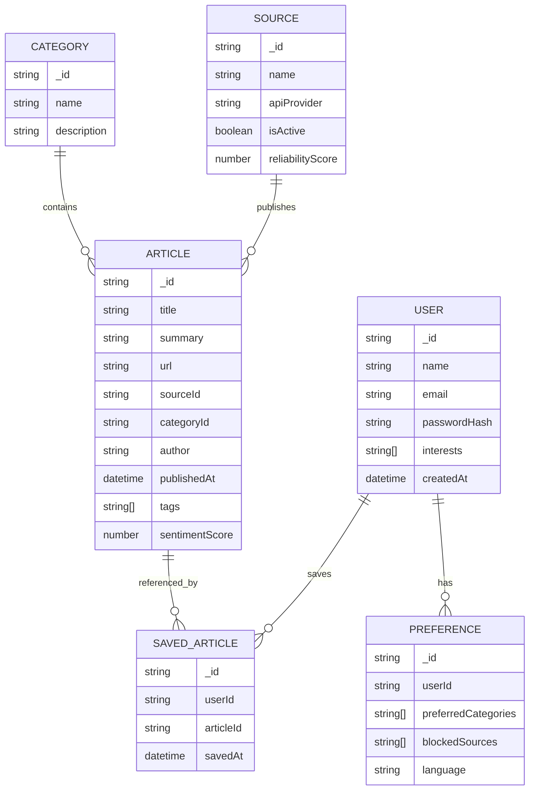

# Database Design and Implementation

## 1. MongoDB Schema Design

NewsSphere AI uses MongoDB as its primary data store because news content is dynamic, semi-structured, and subject to frequent updates. The system stores user profiles, article records, source metadata, saved content, and user preferences in a document-based model.

### Design Principles

- Flexible schemas for varying article metadata
- Fast reads for feed rendering and filtering
- Efficient querying by category, source, date, and user interest
- Support for future personalization and recommendation features
- Clear separation between source data and user-generated data

### Collection Overview

```text
newsphere/
  users
  articles
  sources
  savedArticles
  preferences
  categories
```

---

## 2. Entity Relationship Model

### ER Diagram



### Relationship Explanation

- One user can save many articles.
- One article can be saved by many users.
- One source can publish many articles.
- One category can contain many articles.
- Users have personal preference profiles that guide filtering and recommendations.

---

## 3. Mongoose Models

The backend will use Mongoose schemas to define structure, validation, and querying behavior.

### User Model

```ts
import mongoose, { Schema, Document } from "mongoose";

export interface IUser extends Document {
  name: string;
  email: string;
  passwordHash: string;
  interests: string[];
  savedArticles: mongoose.Types.ObjectId[];
  createdAt: Date;
}

const UserSchema = new Schema<IUser>(
  {
    name: {
      type: String,
      required: true,
      trim: true,
    },
    email: {
      type: String,
      required: true,
      unique: true,
      lowercase: true,
      trim: true,
    },
    passwordHash: {
      type: String,
      required: true,
    },
    interests: {
      type: [String],
      default: [],
    },
    savedArticles: [{
      type: Schema.Types.ObjectId,
      ref: "Article",
      default: [],
    }],
    createdAt: {
      type: Date,
      default: Date.now,
    },
  },
  { timestamps: true }
);

export const User = mongoose.model<IUser>("User", UserSchema);
```

### Article Model

```ts
import mongoose, { Schema, Document } from "mongoose";

export interface IArticle extends Document {
  title: string;
  summary: string;
  content?: string;
  url: string;
  sourceId: mongoose.Types.ObjectId;
  categoryId?: mongoose.Types.ObjectId;
  author?: string;
  publishedAt: Date;
  tags: string[];
  sentimentScore?: number;
  imageUrl?: string;
  isFeatured?: boolean;
}

const ArticleSchema = new Schema<IArticle>(
  {
    title: {
      type: String,
      required: true,
      trim: true,
    },
    summary: {
      type: String,
      required: true,
      trim: true,
    },
    content: {
      type: String,
      default: "",
    },
    url: {
      type: String,
      required: true,
      unique: true,
      trim: true,
    },
    sourceId: {
      type: Schema.Types.ObjectId,
      ref: "Source",
      required: true,
    },
    categoryId: {
      type: Schema.Types.ObjectId,
      ref: "Category",
      default: null,
    },
    author: {
      type: String,
      default: "Unknown",
    },
    publishedAt: {
      type: Date,
      required: true,
    },
    tags: {
      type: [String],
      default: [],
    },
    sentimentScore: {
      type: Number,
      min: -1,
      max: 1,
      default: 0,
    },
    imageUrl: {
      type: String,
      default: "",
    },
    isFeatured: {
      type: Boolean,
      default: false,
    },
  },
  { timestamps: true }
);

export const Article = mongoose.model<IArticle>("Article", ArticleSchema);
```

### Source Model

```ts
import mongoose, { Schema, Document } from "mongoose";

export interface ISource extends Document {
  name: string;
  apiProvider: string;
  isActive: boolean;
  reliabilityScore: number;
  category: string;
}

const SourceSchema = new Schema<ISource>(
  {
    name: {
      type: String,
      required: true,
      unique: true,
    },
    apiProvider: {
      type: String,
      required: true,
      enum: ["GNews", "Guardian", "Custom"],
    },
    isActive: {
      type: Boolean,
      default: true,
    },
    reliabilityScore: {
      type: Number,
      min: 0,
      max: 100,
      default: 50,
    },
    category: {
      type: String,
      default: "general",
    },
  },
  { timestamps: true }
);

export const Source = mongoose.model<ISource>("Source", SourceSchema);
```

### Preference Model

```ts
import mongoose, { Schema, Document } from "mongoose";

export interface IPreference extends Document {
  userId: mongoose.Types.ObjectId;
  preferredCategories: string[];
  blockedSources: string[];
  language: string;
  aiInterests: string[];
}

const PreferenceSchema = new Schema<IPreference>(
  {
    userId: {
      type: Schema.Types.ObjectId,
      ref: "User",
      required: true,
      unique: true,
    },
    preferredCategories: {
      type: [String],
      default: [],
    },
    blockedSources: {
      type: [String],
      default: [],
    },
    language: {
      type: String,
      default: "en",
    },
    aiInterests: {
      type: [String],
      default: [],
    },
  },
  { timestamps: true }
);

export const Preference = mongoose.model<IPreference>("Preference", PreferenceSchema);
```

### SavedArticle Model

```ts
import mongoose, { Schema, Document } from "mongoose";

export interface ISavedArticle extends Document {
  userId: mongoose.Types.ObjectId;
  articleId: mongoose.Types.ObjectId;
  savedAt: Date;
}

const SavedArticleSchema = new Schema<ISavedArticle>(
  {
    userId: {
      type: Schema.Types.ObjectId,
      ref: "User",
      required: true,
    },
    articleId: {
      type: Schema.Types.ObjectId,
      ref: "Article",
      required: true,
    },
    savedAt: {
      type: Date,
      default: Date.now,
    },
  },
  { timestamps: true }
);

export const SavedArticle = mongoose.model<ISavedArticle>("SavedArticle", SavedArticleSchema);
```

### Category Model

```ts
import mongoose, { Schema, Document } from "mongoose";

export interface ICategory extends Document {
  name: string;
  description?: string;
}

const CategorySchema = new Schema<ICategory>(
  {
    name: {
      type: String,
      required: true,
      unique: true,
      trim: true,
    },
    description: {
      type: String,
      default: "",
    },
  },
  { timestamps: true }
);

export const Category = mongoose.model<ICategory>("Category", CategorySchema);
```

---

## 4. Database Connection Setup

Mongoose connection logic should be centralized in a configuration file and loaded from environment variables.

### Example connection setup

```ts
import mongoose from "mongoose";
import dotenv from "dotenv";

dotenv.config();

const MONGO_URI = process.env.MONGO_URI || "mongodb://localhost:27017/newsphere";

export const connectDB = async () => {
  try {
    await mongoose.connect(MONGO_URI);
    console.log("MongoDB connected successfully");
  } catch (error) {
    console.error("MongoDB connection failed:", error);
    process.exit(1);
  }
};
```

### Server usage

```ts
import express from "express";
import { connectDB } from "./config/db";

const app = express();
connectDB();
```

### Recommended environment variables

```env
PORT=5000
MONGO_URI=mongodb://localhost:27017/newsphere
```

---

## 5. Sample Database Records

### User Record

```json
{
  "_id": "64fa6c2f91dfc2b1f7bc1234",
  "name": "Aisha Rahman",
  "email": "aisha@example.com",
  "passwordHash": "$2a$10$abc123xyz",
  "interests": ["technology", "politics", "sustainability"],
  "savedArticles": ["64fa6d4d91dfc2b1f7bc5678"],
  "createdAt": "2026-09-28T10:00:00.000Z"
}
```

### Article Record

```json
{
  "_id": "64fa6d4d91dfc2b1f7bc5678",
  "title": "AI startup launches low-cost climate forecasting tool",
  "summary": "A new startup is using machine learning models to improve climate risk predictions for local communities.",
  "url": "https://example.com/article/ai-climate-tool",
  "sourceId": "64fa6e2f91dfc2b1f7bc9988",
  "categoryId": "64fa6f1f91dfc2b1f7bc3344",
  "author": "John Patel",
  "publishedAt": "2026-09-27T08:30:00.000Z",
  "tags": ["AI", "climate", "technology"],
  "sentimentScore": 0.76,
  "imageUrl": "https://example.com/images/climate.jpg",
  "isFeatured": true,
  "createdAt": "2026-09-28T10:05:00.000Z"
}
```

### Source Record

```json
{
  "_id": "64fa6e2f91dfc2b1f7bc9988",
  "name": "The Guardian",
  "apiProvider": "Guardian",
  "isActive": true,
  "reliabilityScore": 92,
  "category": "world",
  "createdAt": "2026-09-20T09:00:00.000Z"
}
```

### Preference Record

```json
{
  "_id": "64fa6g1f91dfc2b1f7bc2233",
  "userId": "64fa6c2f91dfc2b1f7bc1234",
  "preferredCategories": ["technology", "science", "business"],
  "blockedSources": ["Reuters"],
  "language": "en",
  "aiInterests": ["personalization", "summarization"],
  "createdAt": "2026-09-28T10:10:00.000Z"
}
```

### Saved Article Record

```json
{
  "_id": "64fa6h3f91dfc2b1f7bc5500",
  "userId": "64fa6c2f91dfc2b1f7bc1234",
  "articleId": "64fa6d4d91dfc2b1f7bc5678",
  "savedAt": "2026-09-28T12:12:00.000Z"
}
```

---

## 6. Data Validation Rules

Validation ensures that the database stores clean, consistent, and reliable records.

### User Validation Rules

- `name` is required and trimmed
- `email` is required, unique, and lowercase
- `passwordHash` is required and non-empty
- `interests` must be an array of strings
- `savedArticles` must contain valid Mongo ObjectIds

### Article Validation Rules

- `title` is required
- `summary` is required
- `url` is required and unique
- `sourceId` is required
- `publishedAt` is required
- `sentimentScore` must be between -1 and 1
- `tags` must be an array of strings
- `isFeatured` defaults to false

### Source Validation Rules

- `name` is required and unique
- `apiProvider` must use an allowed value
- `reliabilityScore` must be between 0 and 100
- `isActive` defaults to true

### Preference Validation Rules

- `userId` must be unique per user
- `preferredCategories` is an array of strings
- `blockedSources` is an array of strings
- `language` should be a valid language code, defaulting to `en`

### General Rules

- Use `timestamps: true` for audit tracking
- Avoid duplicate article URLs
- Normalize values before saving to the database
- Validate before insertion to reduce invalid state

---

## 7. Indexing Strategy

To support efficient feed queries, indexes should be applied on commonly searched fields.

```ts
ArticleSchema.index({ publishedAt: -1 });
ArticleSchema.index({ categoryId: 1, publishedAt: -1 });
ArticleSchema.index({ sourceId: 1, publishedAt: -1 });
ArticleSchema.index({ title: "text", summary: "text" });

UserSchema.index({ email: 1 }, { unique: true });
SavedArticleSchema.index({ userId: 1, articleId: 1 }, { unique: true });
```

This allows fast retrieval of recent articles, category-based feeds, and saved-content lookups.

---

## 8. Summary

The database design for NewsSphere AI is built around a flexible document schema in MongoDB, with collections for users, articles, sources, saved items, and preferences. Mongoose provides the schema validation and database modeling layer, while indexed queries ensure efficient reading for the news feed and personalized content experience.

This approach supports the system’s current requirements while remaining scalable for future AI-based ranking, personalization, and analytics.
